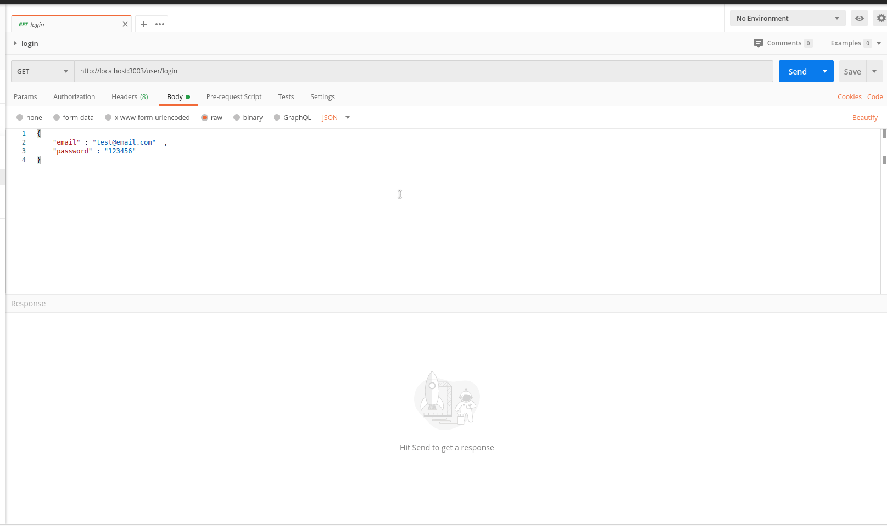

# labook

## Descrição

Implemente o back-end de uma rede social com o objetivo de promover a conexão e interação entre seus mais diversos usuários.
Os usuários podem criar posts de dois tipos ("evento" ou "normal), comentá-los e curti-los também. 


## Importante :

1. Analisar e pensar quais são os endpoints que necessitam do token de autenticação.
2. Lembre-se de que o Backend deve ser muito conciso. Isso significa que você deve prever a maior parte dos erros que possam acontecer e já se precaver contra eles. 

## Endpoints criados:
1. Cadastro
2. Login
3. Fazer amizade
4. Desfazer amizade
5. Criar post
6. Ver o feed

Status do Projeto: Concluido :heavy_check_mark:

### Principais tecnologias utilizadas:

1. Typescript
2. Bcryptjs
3. Express
4. Dotenv
5. Jsonwebtoken
6. ts-node
7. uuid

## Como rodar a aplicação 


No terminal, clone o projeto:

```git clone: https://github.com/felipe0520/labook/ ```

Entre na pasta do projeto  :
```cd labook ```

Instale as dependências : 
```npm install ```

Execute a aplicação:
```npm start ```

Obs: Para rodar a aplicação é necessário um arquivo com as credenciais do banco de dados que não se encontra nesse repositório.
Entre em contato comigo

## Gif do endpoint login abaixo



## Contribuidores

[ <br> <sub> Danilo Mourelle </sub>](https://github.com/danilomourelle) |
| :---: |  
[ <br> <sub> Leonardo Crispim</sub>](https://github.com/leocrispim) |


